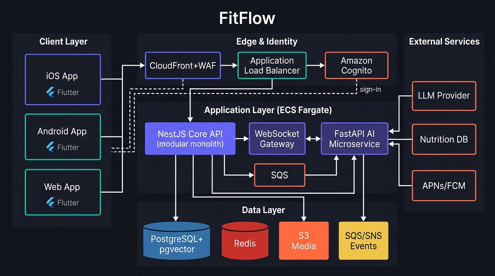

# FitFlow Redesign

Technology selection and architecture for the FitFlow fitness app redesign (IT3060 Human Computer Interaction, Lab Exercise 05).

FitFlow offers personalized AI workout plans, social sharing and challenges, and nutrition tracking across iOS, Android and web, while handling sensitive health data.

> Status: planning and architecture phase. Source code folders are scaffolds; the decisions are documented in `docs/`.

## Recommended technology stack

| Layer | Choice |
|---|---|
| Client (iOS, Android, Web) | Flutter (Dart) with thin native modules (Swift/Kotlin) for HealthKit, Health Connect and widgets |
| Core API | Node.js + NestJS (TypeScript), modular monolith, REST + WebSocket (Socket.IO) |
| AI microservice | Python + FastAPI |
| Primary database | PostgreSQL (Amazon RDS / Aurora) with pgvector |
| Cache / real-time / queues | Redis (ElastiCache) + Amazon SQS/SNS |
| Authentication & authorization | Amazon Cognito (User Pools, MFA, JWT/OIDC) + RBAC in NestJS |
| Object storage / CDN | Amazon S3 + CloudFront |
| Hosting & delivery | AWS ECS Fargate, GitHub Actions CI/CD, CloudWatch + OpenTelemetry + Sentry |

Full rationale: [docs/tech-stack-summary.md](docs/tech-stack-summary.md). Scoring: [docs/comparison-matrix.md](docs/comparison-matrix.md).

## Architecture



Details, data flows and security/scalability/integration notes: [docs/architecture.md](docs/architecture.md).
Decisions: [docs/adr/](docs/adr/).

## Repository structure

```
fitflow-redesign/
├── frontend/          Flutter app (iOS, Android, Web)
├── backend/           NestJS core API (modular monolith)
├── ai-service/        FastAPI AI microservice
├── infra/             Infrastructure as code (optional, e.g. Terraform or CDK)
├── docs/
│   ├── architecture.md
│   ├── comparison-matrix.md
│   ├── tech-stack-summary.md
│   ├── repository-settings.md
│   ├── adr/
│   └── diagrams/
├── scripts/           Repository setup helpers
└── .github/           CI workflow, PR template, Dependabot
```

## Getting started

1. Read the docs listed above.
2. Each service folder has a README with its planned structure and setup steps; implementation starts there.
3. Work on feature branches (`feature/<short-name>`), open a pull request into `main`, and wait for CI and one review.

## Branching and commits

- `main` is protected: pull requests only, one approving review, no force pushes.
- Branch names: `feature/...`, `fix/...`, `docs/...`.
- Commit messages follow Conventional Commits (for example `feat(backend): add workout plan endpoint`).

## Team

By IT23641624 - Ravishan R K

## Licence

Coursework project. Add a licence file if the repository is made public.
