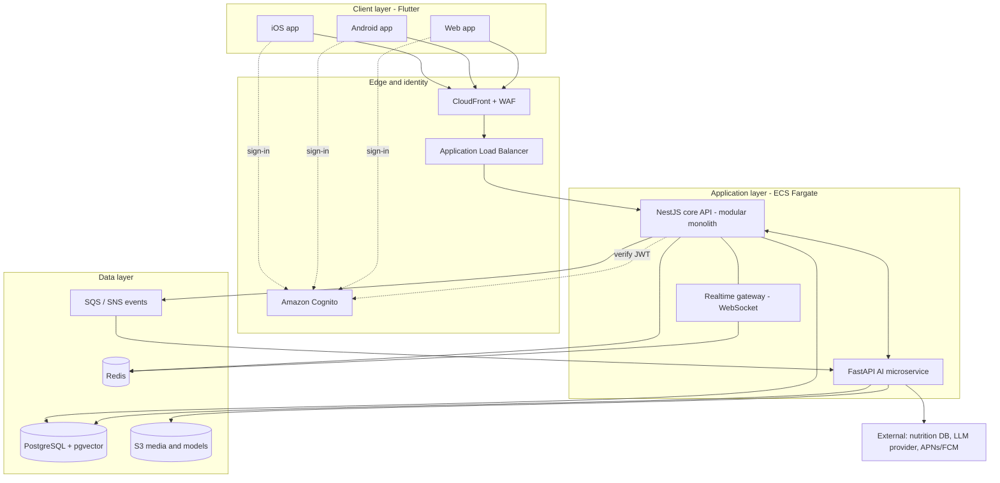

# High-Level Architecture

## Component overview

| Component | Responsibility |
|---|---|
| Flutter clients | UI for iOS, Android and web; local caching; HealthKit / Health Connect access through platform channels |
| CloudFront + WAF + ALB | CDN, TLS termination, rate limiting and OWASP rules, health-checked routing |
| Amazon Cognito | Sign-up, sign-in, MFA, social login, JWT issuance (OIDC) |
| NestJS core API | Users, workout plans, nutrition tracking, social feed, notifications; REST endpoints and WebSocket gateway |
| FastAPI AI service | Workout recommendation, LLM plan generation, food recognition and macro parsing, feature pipeline |
| PostgreSQL (+ pgvector) | System of record for all user, workout, nutrition and social data; embeddings for AI retrieval |
| Redis | Caching, leaderboards, sessions, pub/sub for real-time delivery, rate limiting |
| SQS / SNS | Asynchronous events, fan-out, push notifications |
| S3 | Progress photos, workout media, model artifacts |

## Diagram (Mermaid source)

GitHub renders this diagram automatically.

## Data flows

### Flow 1: Personalized workout plan

1. The user completes onboarding (goal, experience, equipment, injuries, weekly availability) in the Flutter app, which calls POST /v1/plans/generate with the Cognito access token.
2. The ALB forwards the request to the NestJS Workouts module. A JWT guard validates the token against the Cognito JWKS and checks that the user has given consent for health-data processing.
3. The module loads the profile, recent workout logs and wearable summaries from PostgreSQL (profile reads are served from Redis when cached).
4. NestJS calls the AI microservice over internal REST/gRPC (or publishes a plan.requested event to SQS for long-running generation and returns 202 with a job ID).
5. The AI service builds a feature vector, retrieves similar exercise templates using pgvector, runs the recommender and LLM plan generator, then validates the output against the plan schema and safety rules (contraindications, load progression limits).
6. NestJS stores the validated plan (plans, plan_weeks, plan_sessions) in PostgreSQL and invalidates the related Redis keys.
7. The Realtime Gateway pushes a plan.ready message over WebSocket; if the app is in the background, a push notification goes out via SNS to APNs/FCM.
8. The client renders the plan and caches it locally for offline use. Session feedback (completed, too hard, skipped) is stored and used as input to the next adaptation cycle.

### Flow 2: Social sharing

1. After finishing a workout, the user taps Share. The app calls POST /v1/workouts/{id}/share with a visibility setting (private, friends, public) and an optional photo.
2. For a photo, the API returns an S3 pre-signed URL; the client uploads directly to S3 so that media never passes through the API servers. An async worker resizes the image and runs content moderation.
3. The Social module writes the post to PostgreSQL and publishes a post.created event to SNS/SQS.
4. A fan-out worker adds the post to followers' feed timelines in Redis sorted sets (fan-out on write for normal accounts, fan-out on read for accounts with very many followers).
5. The Realtime Gateway publishes through Redis pub/sub so that every API instance can deliver the update to connected followers; offline followers receive a push notification via SNS.
6. Likes and comments follow the same event path. Challenge leaderboards are updated with Redis sorted-set operations and persisted to PostgreSQL periodically.
7. Public share links resolve to a server-rendered page with Open Graph tags, cached by CloudFront, so that link previews work in messaging apps and search engines. Visibility and block lists are re-checked at read time.

### Flow 3: Nutrition tracking

1. The user logs a meal by text search, barcode scan or photo.
2. Text and barcode: the Nutrition module queries the food catalogue in PostgreSQL (full-text search, hot results cached in Redis). On a miss it calls an external nutrition database (for example USDA FoodData Central or Open Food Facts), normalizes the result and stores it.
3. Photo: the image is uploaded to S3 via a pre-signed URL, then the API calls the AI service (/v1/nutrition/recognize), which returns candidate foods, portion estimates and confidence scores.
4. The user confirms or edits the suggestion. The API stores a meal_log row (user, food, quantity, macro snapshot) in PostgreSQL.
5. Daily totals are aggregated (materialized view or Redis counters) and compared with the calorie and macro targets from the active workout plan.
6. Energy expenditure synced from HealthKit or Health Connect in the background adjusts the daily targets.
7. A nightly AI job produces insights and suggestions (for example protein shortfall on training days) which are delivered as in-app cards or notifications.

## Cross-cutting considerations

### Security

- Identity: Cognito User Pools with MFA, short-lived access tokens (about 15 minutes) with refresh-token rotation, and roles (user, coach, admin) carried as Cognito groups. Ownership is enforced in the API and again in PostgreSQL through row-level security.
- Data protection: TLS 1.2+ in transit; AES-256 at rest with KMS for RDS, S3 and ElastiCache; field-level encryption for especially sensitive fields such as injuries and medical conditions; secrets in AWS Secrets Manager; no health data in logs.
- Compliance: GDPR treats health data as a special category (Art. 9), so explicit consent, data minimization, DPIA, and export/erasure endpoints are required. HIPAA applies only if FitFlow acts as a covered entity or business associate; if it does, use HIPAA-eligible AWS services under a signed BAA and keep audit trails. Sri Lanka's Personal Data Protection Act (No. 9 of 2022) applies to local users. Legal review is needed before launch.
- Application security: OWASP MASVS for the mobile apps (Keychain/Keystore storage), AWS WAF rate limiting, input validation with class-validator, parameterized queries through the ORM, dependency scanning (Dependabot) and SAST in CI.
- AI safety: prompt-injection defenses, schema and safety validation of every generated plan, PII minimization before calling an external LLM, provider zero-retention terms, and no training on user data without separate consent.

### Scalability

- Stateless API and AI containers on ECS Fargate scale horizontally on CPU, request rate and (for the AI service) SQS queue depth.
- PostgreSQL: connection pooling (RDS Proxy or PgBouncer), read replicas for feeds and analytics, time-based partitioning of workout and sensor logs, and the option to add TimescaleDB if wearable time-series volume grows.
- Redis absorbs hot reads (profiles, feeds, leaderboards); SQS smooths traffic spikes such as the January sign-up peak.
- CloudFront and S3 serve static and media content. The modular monolith can be split later, with Social/Realtime as the first candidate to extract.
- Availability: Multi-AZ database and cache, health-checked containers, and proposed targets of RPO of 5 minutes or less and RTO of 1 hour or less. Proposed performance budgets: p95 latency under 300 ms for non-AI endpoints.

### Integration

- Health and wearables: HealthKit and Health Connect through platform channels; Garmin, Fitbit and Strava through OAuth and webhooks in an Integrations module.
- Contracts: OpenAPI 3 specification generated from NestJS; a typed Dart client generated from it; the AI service exposes its own OpenAPI schema (Pydantic). All endpoints are versioned under /v1.
- Events: JSON-schema-defined domain events (post.created, plan.requested, plan.ready, meal.logged) on SNS/SQS.
- Third parties: nutrition databases, push notifications (SNS to APNs/FCM), store billing for subscriptions, and an LLM provider behind an adapter interface so the vendor can be swapped.
